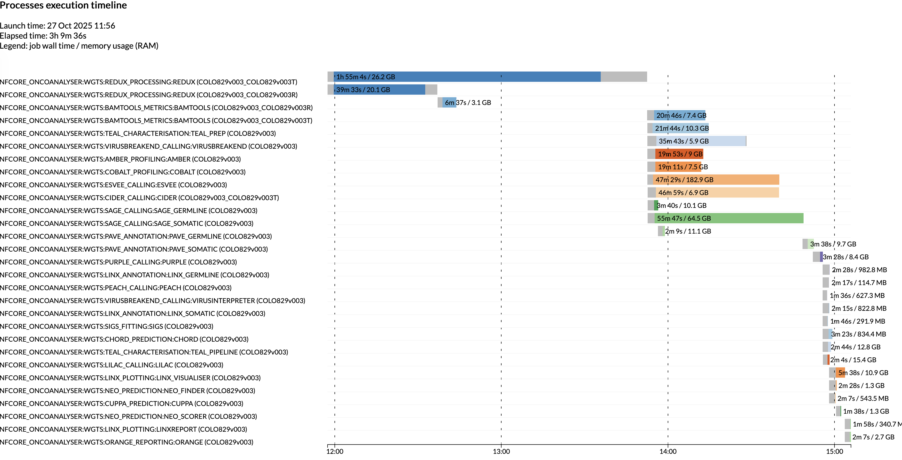

# Compute resources

## Introduction

`oncoanalyser` by default assigns compute resource [labels](https://nf-co.re/docs/usage/getting_started/configuration#tuning-workflow-resources)
to each process which are defined in [conf/base.config](../../conf/base.config) (as is standard in nf-core pipelines).
For example, `process_high` is defined as:

```groovy
process {
    withLabel: process_high {
        cpus   = { 12    * task.attempt }
        memory = { 72.GB * task.attempt }
        time   = { 16.h  * task.attempt }
    }
}
```

The labels used by each process can be grabbed with this command:

```bash
grep -r "label 'process_" modules/*/ | sort

modules/local/amber/main.nf:    label 'process_high'
modules/local/bamtools/main.nf:    label 'process_medium'
modules/local/bwa-mem2/mem/main.nf:    label 'process_high'
...
```

## Recommended settings per process

Hartwig Medical Foundation uses more granular compute resources settings when running `oncoanalyser` in Google Cloud.

The settings below are used for both whole genome and panel sequencing runs. Regular expressions are provided to the
`withName` directive to target multiple processes. Disk space is specified when a process has large files
(BAM or FASTQ files) as input or output.

```groovy
process {
    withName: 'FASTP'            { memory = 72.GB; cpus = 12; disk = 375.GB }
    withName: '.*ALIGN'          { memory = 72.GB; cpus = 12; disk = 750.GB }
    withName: 'AMBER'            { memory = 24.GB; cpus = 16; disk = 375.GB }
    withName: 'BAMTOOLS'         { memory = 24.GB; cpus = 16; disk = 375.GB }
    withName: 'CHORD'            { memory = 12.GB; cpus = 4 }
    withName: 'CIDER'            { memory = 24.GB; cpus = 16; disk = 375.GB }
    withName: 'COBALT'           { memory = 24.GB; cpus = 16; disk = 375.GB }
    withName: 'CUPPA'            { memory = 16.GB; cpus = 4 }
    withName: 'ESVEE'            { memory = 96.GB; cpus = 32; disk = 375.GB }
    withName: 'ISOFOX'           { memory = 24.GB; cpus = 16; disk = 375.GB }
    withName: 'LILAC'            { memory = 64.GB; cpus = 16; disk = 375.GB }
    withName: 'LINX_.*'          { memory = 16.GB; cpus = 8 }
    withName: 'ORANGE'           { memory = 16.GB; cpus = 4 }
    withName: 'PAVE.*'           { memory = 32.GB; cpus = 8 }
    withName: 'PEACH'            { memory = 4.GB ; cpus = 2 }
    withName: 'PURPLE'           { memory = 40.GB; cpus = 8 }
    withName: 'REDUX'            { memory = 72.GB; cpus = 16; disk = 750.GB }
    withName: 'SAGE.*'           { memory = 72.GB; cpus = 16; disk = 375.GB }
    withName: 'TEAL_PREP'        { memory = 72.GB; cpus = 16; disk = 375.GB }
    withName: 'TEAL_PIPELINE'    { memory = 32.GB; cpus = 8 ; disk = 375.GB }
    withName: 'VIRUSBREAKEND'    { memory = 64.GB; cpus = 16; disk = 375.GB }
    withName: 'VIRUSINTERPRETER' { memory = 8.GB ; cpus = 2 }
    withName: 'WISP'             { memory = 16.GB; cpus = 4 ; disk = 375.GB }
}
```

You can use the above config as a starting point for tuning the compute resources for your own runs. For high depth
panel samples for example, you may need to increase the memory for alignment, read processing (REDUX),
and/or small variant calling (SAGE) steps.

## Pipeline performance

The below Nextflow execution timeline shows the runtime and memory usage per process when `oncoanalyser` is run with:

- Paired 100x tumor / 30x normal WGS samples
- Starting from BAMs
- Parallel job execution via Google batch
- The above [recommended settings per process](#recommended-settings-per-process).

Note that your runtime will vary depending on several factors such as sequencing depth, number of small/structural
variants, or parallel vs. non-parallel job execution.

</p>

## Max resources

When running multiple samples in one `oncoanalyser` run, we recommend setting the
[maximum resources](https://nf-co.re/docs/usage/configuration#max-resources) that `oncoanalyser` is allowed to use.
This is to prevent the compounding requested compute resources exceeding the available resources on a machine or
allowed by your job scheduler. An example config could look like:

```groovy
process {
    resourceLimits = [
        cpus:   64,
        memory: 120.GB, // Provides leeway on a 128.GB machine
        disk:   1500.GB,
        time:   48.h
    ]
}
```

## Automatically retry with increased compute resources

You may consider automatically increasing the compute resources upon processes failing, e.g. due to out-of-memory errors.
This can be achieved using [errorStrategy](https://www.nextflow.io/docs/latest/reference/process.html#errorstrategy) and
[maxRetries](https://www.nextflow.io/docs/latest/reference/process.html#maxretries)

In the below example config, we increase the memory for REDUX by 64GB for each attempt.

```groovy
process {
    // Currently, all of WiGiTS tools return a exit code of 1 on failure.
    // We only want to retry for other exit codes which relate to Nextflow or the environment (e.g. out of memory error).
    errorStrategy = { task.exitStatus != 1 ? 'retry' : 'finish' }

    maxRetries = 3

    withName: REDUX {
        memory = check_max( 64.GB * task.attempt, 'memory' )
    }
}
```
